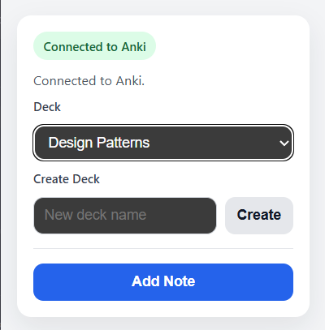
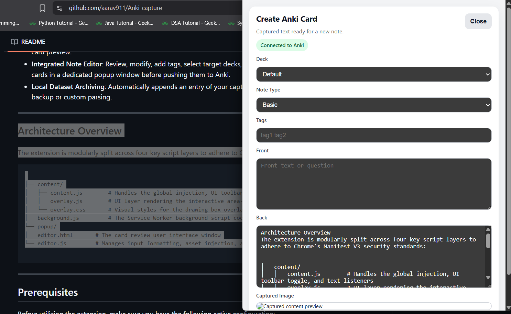
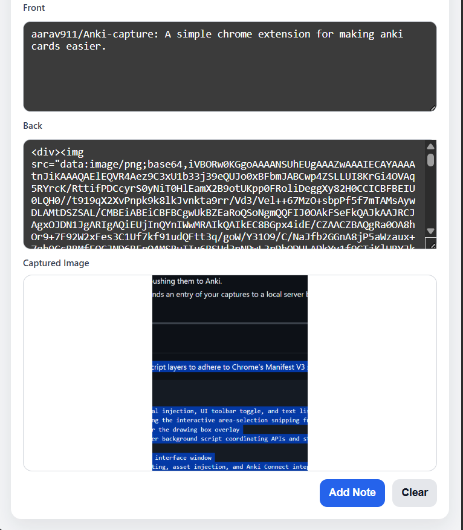
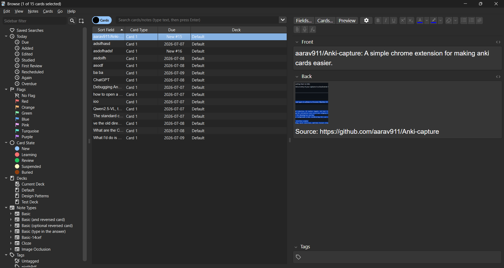

# Anki Capture Extension

Anki Capture is a Chrome extension for turning study material from the browser into Anki cards with as little friction as possible. It supports fast text capture, screenshot area capture, multi-capture card building, and final review in an editor before sending the note to Anki through AnkiConnect.

## Features

* **Shortcut-first capture**: Press `Ctrl+Shift+Y` on Windows/Linux or `Command+Shift+Y` on macOS to open capture mode on the current page.
* **Text capture**: Choose `Text`, highlight webpage text, and the selection is appended to the card's `Back` field.
* **Area capture**: Choose `Area`, drag over part of the page, and the cropped image is appended to the card.
* **Multi-capture cards**: Keep capturing text snippets and image regions into the same pending card, then review everything together.
* **Integrated note editor**: Edit `Front`, `Back`, tags, note type, and deck before adding the note to Anki.
* **Anki media handling**: Captured images are stored through AnkiConnect media before the note is added.
* **Optional dataset logging**: A local append server can archive capture input and final note output for later analysis.

## Prerequisites

1. Anki Desktop installed and running locally.
2. The AnkiConnect add-on installed in Anki.
3. Optional: run `node dataset_server.js` to append capture logs to `anki_capture_dataset.json`.

## Installation

1. Clone or download this repository.
2. Open Chrome and go to `chrome://extensions/`.
3. Enable **Developer mode**.
4. Click **Load unpacked** and select this project directory.
5. After code changes, reload the unpacked extension from `chrome://extensions/`.

## User Flow

1. Start capture from the extension popup or with `Ctrl+Shift+Y` / `Command+Shift+Y`.
2. Use the page toolbar:
   * `Text` or keyboard `T` to capture highlighted text.
   * `Area` or keyboard `A` to capture a page region.
   * `Esc` or `Cancel` to leave capture mode.
3. The editor opens with captured content in the `Back` field.
4. Use **Capture More** to return to the source page and append more content to the same card.
5. Fill in the `Front` field, adjust deck/tags/note type, and click **Add Note**.

Captured page title, URL, and timestamp are kept in capture metadata for logging, but are not inserted into the card fields.

## Architecture

```text
content/
  content.js          Area-selection overlay and screenshot selection events
  overlay.js          Capture toolbar and text-selection flow
  overlay.css         Toolbar and selection styles
background/
  service_worker.js   Chrome message router, storage, AnkiConnect, image crop/media handling
popup/
  popup.html          Small launcher/deck popup
  popup.js            Launcher behavior and deck creation
  editor.html         Card review/editor window
  editor.js           Multi-capture rendering and Add Note flow
dataset_server.js     Optional local capture log append server
```

## Message Reference

| Message Type | Purpose |
| --- | --- |
| `capture-start` | Opens capture toolbar on the active tab |
| `capture-more` | Reopens capture toolbar for the current pending card |
| `capture-text` | Appends selected text to capture storage |
| `capture-area-selection` | Crops and appends a selected screenshot region |
| `get-capture-data` | Loads pending captures into the editor |
| `clear-capture-data` | Clears pending captures |
| `anki-get-decks` | Loads Anki deck names |
| `anki-create-deck` | Creates a deck through AnkiConnect |
| `anki-add-note` | Stores captured media and adds the final note |

## Images





